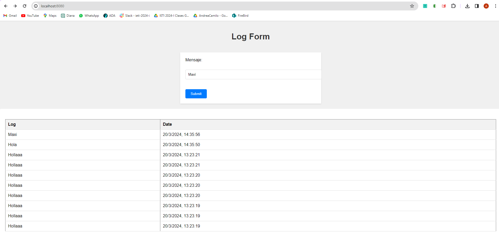

# AREP - Taller 6

## Descripción

El laboratorio es un prototipo de una aplicación de registro de logs distribuida y balanceada con Round Robin, 
utilizando Docker para facilitar la portabilidad y escalabilidad. Se exploran patrones arquitectónicos en AWS y su implementación 
en aplicaciones web, utilizando SparkJava para servicios REST y MongoDB para almacenamiento de datos. 
Todo se ejecuta en contenedores Docker y se despliega en una instancia EC2 de AWS, combinando técnicas avanzadas de arquitectura 
de software con tecnologías modernas de desarrollo web y almacenamiento de datos para mejorar la eficiencia, 
escalabilidad y mantenibilidad de la aplicación.


## Comenzando

Las siguientes instrucciones le permitirán obtener una copia del proyecto en funcionamiento en su máquina local para fines de desarrollo y prueba.

### Requisitos

- [Git](https://www.youtube.com/watch?v=4xqVv2lTo40/) - Control de versiones
- [Maven](https://www.youtube.com/watch?v=1QfiyR_PWxU) - Gestor de dependencias
- [Java 17](https://www.youtube.com/watch?v=BG2OSaxWX4E) - Lenguaje de programación
- [Docker](https://www.youtube.com/watch?v=ZO4KWQfUBBc) - Motor de contenedores
- [Docker Compose](https://www.youtube.com/watch?v=Qw9zlE3t8Ko) - Herramienta para definir y ejecutar aplicaciones Docker de múltiples contenedores

## Instalación

Para hacer una copia local del proyecto, debemos abrir nuestra terminal, dirigirnos al directorio donde estará el proyecto y usar el siguiente comando

```bash
git clone https://github.com/andreaduranvivas/AREP-Taller6
```

Nos dirigimos al directorio creado con

```bash
cd AREP-Taller6
```


## Ejecutando la aplicación

Para ejecutar la aplicación, primero debemos compilar el proyecto con el siguiente comando `mvn clean install`
. Esto nos permitirá limpiar las construcciones previas de otras versiones y luego compilará el proyecto.

Y ejecutamos el siguiente comando para crear 5 contenedores. 3 de ellos serán instancias de logService, 1 será la instancia de la base de datos y el otro el del
balanceador de carga que usa round robin.

```bash
docker-compose up -d
```

Para visualizar la aplicación, escogemos algún navegador e ingresamos la URL http://localhost:8080/ en la barra de direcciones. Allí encontraremos la página principal de la aplicación,
la cual se basa en un formulario que nos permite ingresar un log y un botón para enviarlo. Una vez enviado, el log se almacenará en la base de datos y se mostrará en la página principal.
Cuando se da clic en el botón, veremos una tabla donde se resumen las principales características (el mensaje y la fecha), pero si le damos enter, podremos ver la información en formato JSON.



A continuación se presenta un video demostrando el funcionamiento de la aplicación, haciendo uso de una instancia de EC2 en AWS.
En este caso, lo único que cambiamos es la URL, ya que ya no sería localhost, sino el DNS de la IPv4 pública de nuestra VM.
Cabe recordar que se deben agregar las reglas de entrada a la instancia para poder ejecutar la aplicación, se deben abrir los puertos
8080, 35001, 35002, 35003 y 27017.

[](https://youtu.be/AINZ3AHpHRU)


## Pruebas

Se realizaron pruebas unitarias y pruebas de integración.
Las pruebas unitarias están enfocadas al funcionamiento de la base de datos y se 
pueden correr con el comando `mvn test`

## Documentación

Para visualizar la documentación del proyecto solo debes correr el siguiente comando desde el directorio raiz del proyecto

```bash
mvn javadoc:javadoc
```

Y en la siguiente ruta encontrarás el archivo index.html en donde si lo abres desde el navegador podras ver toda la documentación

```
./target/site/apidocs
```

## Arquitectura de la aplicación

La arquitectura del prototipo consta de los siguientes componentes:

- **APP-LB-RoundRobin:** La aplicación principal que se encarga de recibir las solicitudes de registro de logs. 
Utiliza el algoritmo de Round Robin para balancear la carga entre múltiples instancias de LogService.
  Está compuesta por un cliente web y al menos un servicio REST. Cuando un usuario envía un mensaje, el cliente web lo envía al servicio REST,
este último procesa el mensaje y actualiza la pantalla del cliente web con la información devuelta en formato JSON.


- **LogService:** Tres instancias LogService, diseñadas para manejar las solicitudes de registro de logs y almacenar los datos de manera distribuida.
Se trata de un servicio REST que recibe cadenas de texto (el log), las almacena y retorna en un objeto JSON las 10 últimas cadenas almacenadas y sus fechas correspondientes.


- **MongoDB:** Una instancia de MongoDB que se ejecuta dentro de un contenedor Docker en una máquina virtual EC2 utilizada como base de datos para almacenar los logs. 
Esta base de datos se utiliza para almacenar los registros de logs de manera persistente ue recibe el servicio LogService.

A continuación se ve el diagrama de la arquitectura


## Autores

- **Andrea Durán** - [Usuario en GitHub](https://github.com/andreaduranvivas)

## Construido con

* [Spark Framework](https://sparkjava.com/) - Java/Kotlin web framework
* [Maven](https://maven.apache.org/) - Dependency Management
* [Java](https://www.java.com/es/) - Programming Language
* [JavaScript](https://developer.mozilla.org/en-US/docs/Web/javascript) - Programming Language
* [CSS](https://www.w3.org/Style/CSS/Overview.en.html) - stylesheet Language
* [HTML](https://html.com/) - HyperText Markup Language
* [Docker](https://www.docker.com/) - Containers Software


## Versiones


## Licencia

Este proyecto está bajo la licencia MIT. Ver el archivo [LICENSE](LICENSE) para más detalles.

## Agradecimientos

- Al profesor [Luis Daniel Benavides Navarro](https://ldbn.is.escuelaing.edu.co/)
